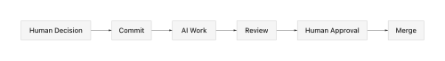

# Governance Model

> How knowledge enters the system and how work flows through the organization

---

## Core Concept

**The source of truth is the foundation.** When changes are committed, they trigger work. Humans decide what to work on. AI executes. Humans approve results.



---

## Principles

1. **Accuracy First** — Only verified, correct information enters the source of truth
2. **Accountability** — Every change has an author and approver(s)
3. **Transparency** — All changes are visible and auditable via Git
4. **Domain Expertise** — Approvers are subject matter experts
5. **Chain of Custody** — Every step is tracked: who did what, who approved it

---

## Roles

### Contributor
Anyone who can propose changes.

**Permissions:**
- Clone/fork repositories
- Create branches
- Submit pull requests
- Respond to review comments

**Who:** AI assistants, analysts, engineers, anyone with access

---

### Reviewer
Can review and comment but cannot approve.

**Permissions:**
- All Contributor permissions
- Add review comments
- Request changes
- Discuss in PR threads

**Who:** Team members, stakeholders, AI reviewers (for preliminary review)

---

### Approver
Can approve pull requests, signaling the content is accurate.

**Permissions:**
- All Reviewer permissions
- Approve pull requests
- Block merges if issues found

**Who:** Department heads, senior analysts, designated experts

---

### Repo Owner
Final authority for a repository. Merges approved changes.

**Permissions:**
- All Approver permissions
- Merge pull requests
- Override in emergency situations
- Manage branch protection rules

**Who:** The person accountable for that repository's content

---

## The Human Role: Pull Request Approval

**The primary human job is reviewing and approving PRs.**

This is a fundamental shift:
- **Before:** Humans do the work AND review it
- **After:** AI does the work, humans approve it

Humans are freed FROM doing the work, not burdened with more review.

**Every human becomes a manager of AI work output.**

---

## Approval Model

**All approvals are unanimous** — any designated Approver can approve. No voting, no ordering, no sequencing.

The only question: **How many approvals are required?**

### Single Approver (1 required)
```
PR Submitted → Review → 1 Approver Approval → Merge
```
- Fast path for lower-risk changes
- GitHub setting: `required_approving_review_count: 1`

### Multiple Approvers (N required)
```
PR Submitted → Review → N Approver Approvals → Merge
```
- For higher-risk or cross-domain changes
- GitHub setting: `required_approving_review_count: N`

---

## AI and Governance

### AI as Contributor
- AI submits PRs from dedicated GitHub accounts
- PRs clearly show AI authorship
- **AI cannot approve its own PRs**

### AI as Reviewer (Future)
- AI can review other AI's work
- AI can flag issues, suggest improvements
- Human makes final approval decision (initially)

### Audit Trail
- All AI contributions tracked in Git
- User responsible for their AI's submissions
- Complete chain of custody for compliance

---

## GitHub Implementation

### Branch Protection Rules

```yaml
# Standard protection
required_pull_request_reviews:
  required_approving_review_count: 1
  dismiss_stale_reviews: true
  require_code_owner_reviews: true
```

### CODEOWNERS File

Route reviews to domain experts:

```
# Example CODEOWNERS
/docs/           @docs-team
/config/         @config-team
/policies/       @operations-team
*                @repo-owner
```

---

## Progressive Automation


**Phase 1 (Now): Human approves all PRs**

**Phase 2: AI pre-review, human final approval**

**Phase 3: AI-to-AI with human oversight**

**Phase 4: Full automation for verified paths**
- Verified chains of steps
- Thousands of steps without error
- Humans only intervene on exceptions

**As trust builds, humans exit loops. Velocity increases.**

---

## Emergency Changes

For critical/urgent changes:

1. Repo Owner can merge with expedited review
2. Must document reason in PR
3. Post-merge review required within 24 hours
4. Notify stakeholders immediately

---

*Simple governance: Humans decide, AI executes, humans approve. Full transparency at every step.*
