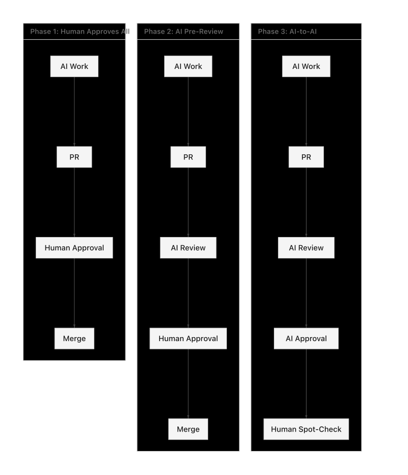

# Governance Model

> How knowledge enters the system and how work flows through the organization

---

## Core Concept

Your organization has **Library Repos** — repositories that contain verified knowledge. When knowledge is committed to a Library Repo, it can trigger **Agents** to do work. Agents commit their work to **Output Repos** where humans review and approve it.

```
Library Repo (knowledge) → Dispatch → Agents → Output Repo (work product)
                                                      ↓
                                               Human Approval
```

**The fundamental loop:**
1. Humans commit knowledge to Library Repos
2. Agents wake up and do work based on that knowledge
3. Agents commit their work to Output Repos
4. Humans review and approve the work

---

## Library Repos

A **Library Repo** is a source of verified knowledge. Each Library Repo has:

| Component | Description |
|-----------|-------------|
| **Owner** | The person accountable for the repo's accuracy |
| **Contributors** | People (or AIs) who can propose changes |
| **Approvers** | Experts who verify content before merge |
| **Dispatch Rules** | Which agents should wake up when content changes |

### Examples of Library Repos

- **Lending Guidelines** — FNMA, FHA, VA guidelines
- **Company Policies** — HR, compliance, operations
- **Product Specs** — Requirements, configurations
- **Training Materials** — Procedures, best practices

### The Rule

> **Only what is *right* goes into a Library Repo.**

Library Repos are the source of truth. If the knowledge is wrong, everything built on it will be wrong.

---

## Agents

An **Agent** is an AI with a specific job. Think of it like an employee with:

| Component | Description |
|-----------|-------------|
| **Job Description** | What the agent does (e.g., "Generate configuration specs") |
| **Skills** | What tools the agent can use (e.g., search, write, analyze) |
| **Triggers** | What commits wake the agent up |
| **Output** | Where the agent commits its work |

### How Agents Work

Agents are simple:
1. They **watch** for commits to specific folders in Library Repos
2. When triggered, they **read** the changed content
3. They **determine** what work needs to be done (if any)
4. They **do the work** using their skills
5. They **commit** their output to an Output Repo

### Example Agents

| Agent | Watches | Does | Outputs To |
|-------|---------|------|------------|
| Spec Generator | `guidelines/fnma/` | Generates system specs from guidelines | `specs/` repo |
| Doc Writer | `policies/` | Creates training docs from policies | `training/` repo |
| Config Validator | `config/` | Validates configurations against specs | Same repo (PR) |

---

## The Dispatch System

A **Central Dispatch** watches all Library Repos and routes work to the right agents.

```
┌─────────────────────────────────────────────────────────────┐
│                      LIBRARY REPOS                          │
│  ┌──────────┐  ┌──────────┐  ┌──────────┐  ┌──────────┐    │
│  │Guidelines│  │ Policies │  │  Specs   │  │ Config   │    │
│  └────┬─────┘  └────┬─────┘  └────┬─────┘  └────┬─────┘    │
└───────┼─────────────┼─────────────┼─────────────┼──────────┘
        │             │             │             │
        └─────────────┴──────┬──────┴─────────────┘
                             │
                             ▼
                 ┌───────────────────────┐
                 │   CENTRAL DISPATCH    │
                 │                       │
                 │  • Watches for commits│
                 │  • Looks up rules     │
                 │  • Wakes agents       │
                 └───────────┬───────────┘
                             │
           ┌─────────────────┼─────────────────┐
           │                 │                 │
           ▼                 ▼                 ▼
    ┌────────────┐    ┌────────────┐    ┌────────────┐
    │  Agent A   │    │  Agent B   │    │  Agent C   │
    │ (Spec Gen) │    │ (Doc Write)│    │ (Validator)│
    └──────┬─────┘    └──────┬─────┘    └──────┬─────┘
           │                 │                 │
           ▼                 ▼                 ▼
    ┌────────────┐    ┌────────────┐    ┌────────────┐
    │ Specs Repo │    │Training Rep│    │ Config Repo│
    │   (PR)     │    │    (PR)    │    │   (PR)     │
    └────────────┘    └────────────┘    └────────────┘
           │                 │                 │
           └─────────────────┴─────────────────┘
                             │
                             ▼
                    ┌─────────────────┐
                    │ Human Approval  │
                    └─────────────────┘
```

### Dispatch Rules

Each Library Repo can have dispatch rules that specify:

```yaml
# Example: When guidelines change, trigger spec generator
triggers:
  - path: "guidelines/fnma/**"
    agent: spec-generator
    output: specs-repo
    
  - path: "guidelines/fha/**"
    agent: spec-generator
    output: specs-repo
    
  - path: "policies/**"
    agent: doc-writer
    output: training-repo
```

---

## Output Repos

An **Output Repo** is where agents commit their work. It may be:

- **The same repo** (agent creates a PR in the Library Repo)
- **A different repo** (agent outputs to a dedicated work repo)
- **A personal workspace** (agent outputs to a human's review folder)

### Why Separate Output Repos?

Separating input (Library) from output (Work) repos provides:

1. **Clean separation** — Knowledge vs. generated artifacts
2. **Different owners** — Library owned by SMEs, Output owned by consumers
3. **Different review cycles** — Library changes rarely, Output changes often
4. **Blast radius** — Agent mistakes don't pollute the source of truth

---

## Roles

### Repo Owner
Final authority for a repository. Sets the rules.

**Permissions:**
- Merge pull requests
- Define dispatch rules (which agents respond to changes)
- Manage branch protection
- Override in emergencies

**Who:** The person accountable for that repository's content

---

### Approver
Can approve pull requests, signaling the content is accurate.

**Permissions:**
- Approve pull requests
- Block merges if issues found

**Who:** Domain experts, senior analysts, designated reviewers

---

### Contributor
Anyone who can propose changes.

**Permissions:**
- Create branches
- Submit pull requests
- Respond to review comments

**Who:** Humans, AI agents, automated systems

---

## The Human Role

**Humans do two things:**

1. **Commit knowledge** to Library Repos
2. **Approve work** in Output Repos

That's it. The agents handle everything in between.

This is a fundamental shift:
- **Before:** Humans do the work AND review it
- **After:** Humans provide knowledge, AI does work, humans approve results

**Every human becomes a manager of AI work output.**

---

## Progressive Automation



**Phase 1: Human approves all agent work**
- Every PR from an agent requires human approval

**Phase 2: AI pre-review, human final approval**
- Agents review each other's work
- Human does final approval

**Phase 3: AI-to-AI with human oversight**
- Low-risk changes auto-approved by AI
- Human spot-checks periodically

**Phase 4: Full automation for verified paths**
- Proven workflows run autonomously
- Humans only intervene on exceptions

**As trust builds, humans exit loops. Velocity increases.**

---

## Chain of Custody

Every step is tracked:

| Step | Recorded |
|------|----------|
| Knowledge committed | Who, when, what changed |
| Dispatch triggered | Which agents, why |
| Agent work | What was done, what was output |
| PR created | By which agent, to which repo |
| Approval | By whom, when |
| Merge | By whom, when |

Complete audit trail for compliance.

---

## GitHub Implementation

### Branch Protection

```yaml
required_pull_request_reviews:
  required_approving_review_count: 1
  dismiss_stale_reviews: true
  require_code_owner_reviews: true
```

### CODEOWNERS

Route reviews to domain experts:

```
# Example CODEOWNERS
/guidelines/     @compliance-team
/policies/       @operations-team
*                @repo-owner
```

---

## Summary

| Component | Purpose |
|-----------|---------|
| **Library Repos** | Source of truth — verified knowledge |
| **Agents** | Workers — do specific jobs when triggered |
| **Dispatch** | Router — watches commits, wakes agents |
| **Output Repos** | Work products — where agents commit results |
| **Humans** | Knowledge providers + Approvers |

```
Knowledge → Dispatch → Agents → Work → Approval → Done
```

*Simple governance: Humans provide knowledge, AI does work, humans approve. Full transparency at every step.*
