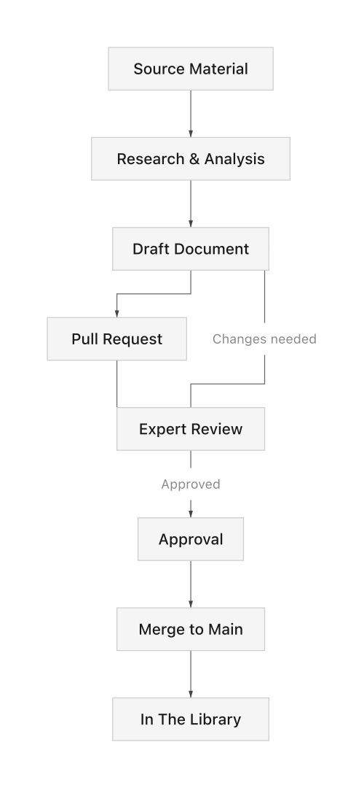

# The Library

> Your Source of Truth

---

## What is The Library?

The Library is the collection of repositories that contain your organization's institutional knowledge. It is the **single source of truth** that both humans and AI use to:

- Make decisions
- Generate specifications
- Validate configurations
- Research guidelines
- Create documentation

---

## Why The Library Matters

### The Problem

Without a source of truth:
- Knowledge lives in people's heads
- Different people have different "facts"
- AI hallucinates or uses outdated information
- Inconsistency leads to errors and rework

### The Solution

With The Library:
- Knowledge is encoded and versioned
- Everyone references the same facts
- AI grounds responses in verified information
- Changes are reviewed and approved
- History is preserved

---

## Core Principle

> **Only what is *right* goes into The Library.**

This means:
- Every addition is reviewed by experts
- Incorrect information is corrected promptly
- Outdated content is archived or updated
- Quality over quantity

If The Library is wrong, everything built on it will be wrong.

---

## How Content Enters The Library

### Who Can Contribute

- **Humans**: Analysts, engineers, domain experts
- **AI Assistants**: Draft content for human review
- **Automated Systems**: Extract and format from authoritative sources

---

## AI and The Library

### AI as Reader

AI assistants use The Library to:
- Answer questions accurately
- Generate compliant specifications
- Validate configurations
- Research before recommending

### AI as Contributor

AI assistants can propose additions:
- Generate draft requirements from guidelines
- Identify gaps in documentation
- Suggest updates when sources change

**All AI contributions require human approval.**

### Grounding

When AI uses The Library:
- Responses cite specific documents
- Confidence is higher (grounded vs. hallucinated)
- Audit trail shows what information was used

---

## Quality Standards

### Accuracy
- Content must be factually correct
- Sources must be cited
- Effective dates must be noted

### Completeness
- No partial information that could mislead
- Edge cases documented
- Dependencies identified

### Currency
- Content reflects current requirements
- Superseded information archived
- Review dates tracked

### Clarity
- Unambiguous language
- Consistent terminology
- Structured format

---

## Versioning & History

The Library uses Git for:
- **Version Control**: Every change tracked
- **History**: Who changed what, when, why
- **Rollback**: Can revert to previous state
- **Branching**: Work on changes without affecting main

---

## Access Levels

| Level | Can Do |
|-------|--------|
| **Read** | Clone, read all content |
| **Write** | Create branches, submit PRs |
| **Approve** | Approve PRs in domain |
| **Admin** | Manage repo settings, merge |

---

## Maintenance

### Regular Reviews
- Quarterly review of high-change areas
- Annual review of all content
- Triggered review when source documents update

### Deprecation Process
1. Mark content as deprecated
2. Note replacement (if any)
3. Archive after transition period
4. Remove references from active use

---

*The Library is the foundation. Build it right.*
